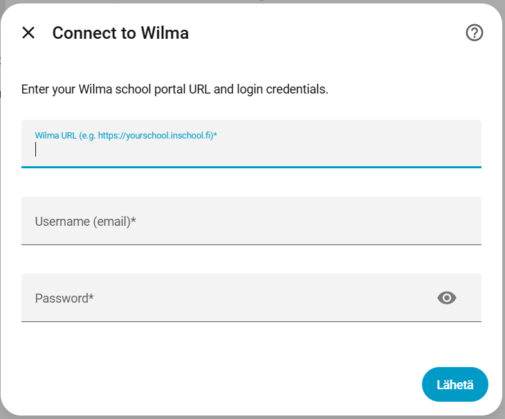
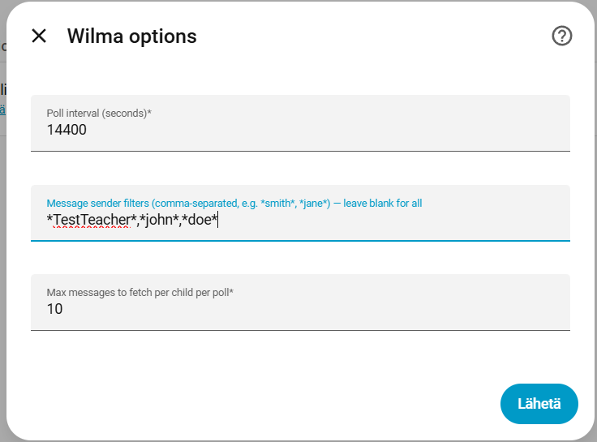
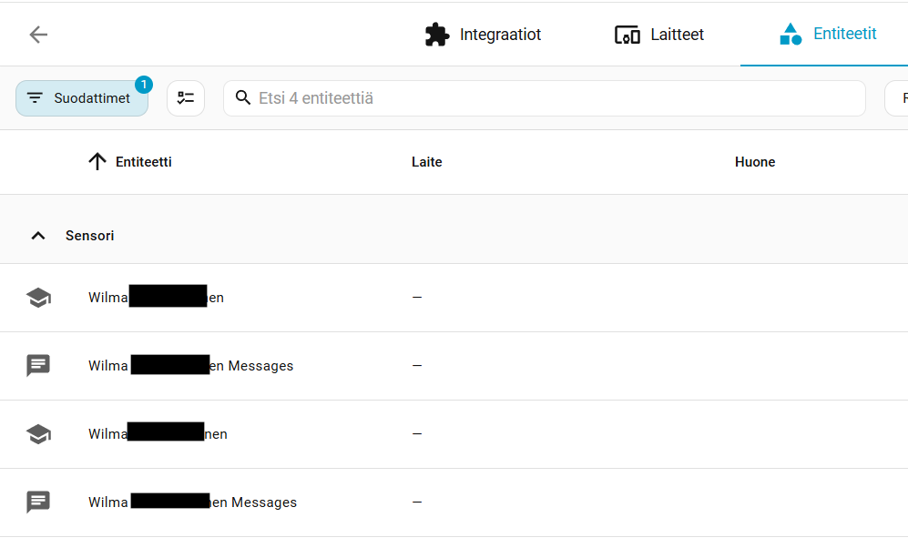
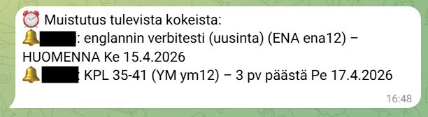
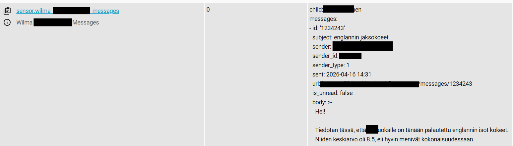

# Wilma Home Assistant Integration

A custom Home Assistant integration that monitors the [Wilma](https://www.visma.com/finland/wilma/) school portal and exposes upcoming exams and school messages as sensors.

## Features

### Exams
- One sensor per child showing upcoming exam count
- Exam details available as sensor attributes (date, topic, subject, teacher)
- Fires `wilma_new_exam` event when a new exam appears — use for Telegram notifications

### Messages
- One sensor per child showing unread message count
- Fetches the 10 latest messages per child each poll cycle
- Message body, sender, subject and timestamp available as sensor attributes
- Fires `wilma_new_message` event when a new message arrives — use for Telegram notifications
- Built-in sender filter ("spam filter"): configure glob patterns (e.g. `*smith*`) to only track messages from specific teachers — leave blank to track all

### General
- Children are auto-discovered after login — no manual ID lookup needed
- Configurable poll interval, message limit, and sender filters — all via the UI

## Screenshots

| Setup | Options |
|---|---|
|  |  |

| Sensors | Telegram notification |
|---|---|
|  |  |

## Installation via HACS

1. Add this repository as a custom repository in HACS (category: Integration)
2. Install **Wilma** from HACS
3. Restart Home Assistant
4. Go to **Settings → Devices & Services → Add Integration** and search for **Wilma**
5. Enter your Wilma URL, username and password — children are discovered automatically

## Configuration

All configuration is done through the UI. No changes to `configuration.yaml` are needed.

| Field | Example | Description |
|---|---|---|
| Wilma URL | `https://yourschool.inschool.fi` | Base URL of your school's Wilma instance |
| Username | `your@email.com` | Your Wilma login email |
| Password | | Your Wilma password |

The following options can be changed after setup via the **Configure** button on the integration page:

| Option | Default | Description |
|---|---|---|
| Poll interval | `14400` | Seconds between Wilma polls |
| Sender filters | *(blank)* | Comma-separated glob patterns, e.g. `*smith*, *jones*` — blank means all senders |
| Message limit | `10` | Max messages fetched per child per poll |

### Credential storage

Credentials are stored in Home Assistant's config entry storage (`/.storage/core.config_entries`) and are never exposed through the HA UI or API. This is the standard HA mechanism used by all integrations that require authentication — the same way integrations like Spotify or Google handle credentials. Note that the storage file itself is not encrypted at rest; secure your Home Assistant instance accordingly.

## Sensor attributes

### Exam sensor (`sensor.wilma_<child_name>`)

| Attribute | Description |
|---|---|
| `exams` | List of all upcoming exams |
| `next_exam` | The next upcoming exam |
| `next_exam_date` | ISO date of the next exam (e.g. `2026-04-20`) |

Each exam in the list has: `date`, `date_iso`, `topic`, `subject`, `group`, `teacher`, `details`.



### Message sensor (`sensor.wilma_<child_name>_messages`)

State = number of unread messages in the current window.

| Attribute | Description |
|---|---|
| `messages` | List of fetched messages (up to the configured limit) |
| `latest_message` | The most recent message |

Each message in the list has: `id`, `subject`, `sender`, `sender_id`, `sent`, `is_unread`, `body`, `url`.

## Automations

See [`docs/automations_example.yaml`](docs/automations_example.yaml) for example automations:
- Telegram notification on new exam
- Daily reminder 1 and 3 days before an exam
- `/exams` Telegram command to list all upcoming exams
- Telegram notification on new message

## Disclaimer

This is an unofficial, personal open-source project and is not affiliated with, endorsed by, or connected to Visma or the Wilma school portal in any way. Use at your own risk. The author takes no responsibility for any issues arising from the use of this integration, including but not limited to data loss, incorrect data, or service disruptions. Users are responsible for ensuring their use complies with their school's Wilma terms of service.

## Tools

`tools/wilma_client.py` is a standalone test script for verifying connectivity and inspecting raw data without Home Assistant:

```bash
python tools/wilma_client.py
```
